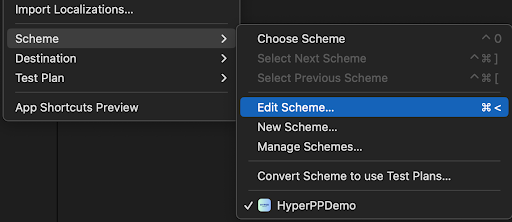
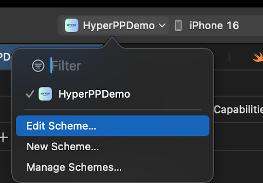
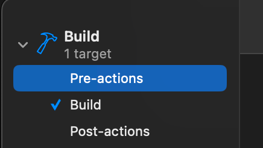
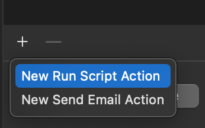
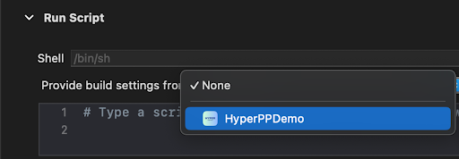

# VisaBenefitsSDK

## **Integration Guide**

To install the VisaBenefitsSDK into your application via Swift Package Manager follow two steps:

1. Installing Assets Plugin
2. Installing VisaBenefitsSDK

Following sections describe how to complete above steps

## **1.1. Installing Assets Plugin**

VisaBenefitsSDK depends on certain assets to function. These are available over the air and are supposed to be present while building the SDK. The Assets Plugin is a build time dependency that downloads all required assets and ensures the availability of the latest assets at build time.

To install Assets Plugin follow the below steps:

### **Step 1.1a - Add Build Pre-actions Script**

In Xcode, go to the menu and select **Product** → **Scheme** → **Edit Scheme…**.



Alternatively, you can select your target from the scheme drop-down in Xcode's toolbar and choose **Edit Scheme...**.



In the Scheme Editor, expand **Build** and select **Pre-actions.**



Add a New Run Script Action.



Select the app target for **Provide build settings from**



Paste the below shell script:

```ruby
if [[ "${ACTION}" == "clean" ]]; then
  cd "${PROJECT_DIR}"
  echo "Running Fuse.rb script..."
  ruby "${BUILD_DIR%Build/*}SourcePackages/checkouts/visa-ios/Sources/VisaBenefitsSDK/Fuse.rb"
fi
```

This Script will be executed whenever you do **Clean Build Folder**.

### **Step 1.1b - Add VisaBenefitsConfig.json**

The VisaBenefitsConfig.json contains the clientIds which helps the Assets plugin to download assets specific to your application. Create a .json file named VisaBenefitsConfig.json inside the app directory of your project. Add clientConfigs to this file. Please note to add this to the folder where the project file is present.

_Sample:_

```json
{
 "clientConfigs": {
	"your-client-id": {}
 }
}
```

## **1.2. Installing VisaBenefitsSDK**

### Swift Package Manager

Add VisaBenefitsSDK to your project using Xcode:

1. Open your project in Xcode
2. Go to File → Add Package Dependencies

3. Enter the package URL: `https://github.com/yourorg/visa-ios.git`


4. Select the version you want to use


5. Add the package to your target


Or add it to your `Package.swift` file:

```swift
dependencies: [
    .package(url: "https://github.com/juspay/visa-ios.git", from: "1.0.0")
]
```
## License

This project is licensed under the MIT License - see the LICENSE file for details.